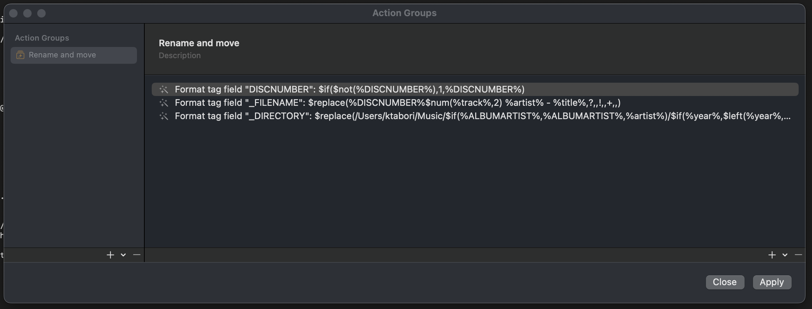

### Convert Rate Tag into Comment

As mentioned in the full guide, to make the Python script with plexx to work,the ratings from Swinsian needs to be converted into comment tags.



1. **Set Disc Number** 
I make sure that the track has a disc number. If the disc number is not set, I default it to disc 1. 

 **Format tag field** 
Field: `DISCNUMBER`
```text
$if($not(%DISCNUMBER%),1,%DISCNUMBER%)
```

2. **Set File Name**
I set the file name using the following formula:

 **Format tag field** 
Field: `_FILENAME`
```text
$replace(%DISCNUMBER%$num(%track%,2) %artist% - %title%,?,,!,,+,,)
```
Example: 101 Daft Punk - One More Time.m4a

3. **Move Track to Desired Location**
I move the track to the desired location using this formula:

**Format tag field** 
Field: `_DIRECTORY`
```text
$replace(/Path/To/Your/Music/$if(%ALBUMARTIST%,%ALBUMARTIST%,%artist%)/$if(%year%,$left(%year%,4),0000) %ALBUM%/,?,,!,,+,,)
```
Example: /Path/To/Your/Music/Daft Punk/2001 Discovery